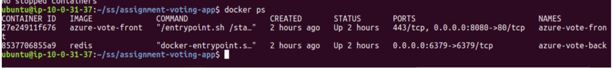
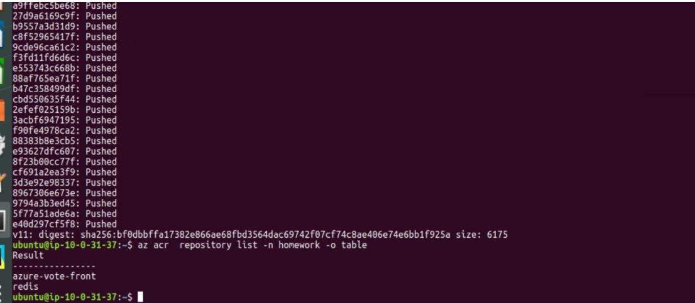

# homework-k8

##PB1
#### COMMANDS:
```
git clone https://github.com/amirdaniely/assignment-voting-app.git
cd assignment-voting-app
docker-compose up -d
docker ps
```



------------

##PB2
#### COMMANDS:
```
az login
az account show --output table
# Create resource group:
az group create -n homework -l "westus2"
# Create acr:
az acr create -n homework -g homework -l "westus2" --sku standard
# describe acr:
az acr list -o table
# login to repo homework:
az acr login -n homework
# This is the login server name - homework.azurecr.io
# Tag the image:
docker tag  redis:latest homework.azurecr.io/redis:v11
docker tag  azure-vote-front homework.azurecr.io/azure-vote-front:v11
# Verify:
docker images docker image list
# Push the images to the registry:
docker push homework.azurecr.io/redis:v11
docker push homework.azurecr.io/azure-vote-front:v11
# List the pushed images:
az acr  repository list -n homework -o table
az acr repository show --name homework --image redis:v11
az acr repository show --name homework --image azure-vote-front:v11
az acr repository show -n homework --image sha256:bf0dbbffa17382e866ae68fbd3564dac69742f07cf74c8ae406e74e6bb1f925a

```




##PB3
#### COMMANDS:

```
# Create service principal, granting permissions for the aks to perform a pull action and other actions:
az ad sp create-for-rbac --skip-assignment
output ->
{
  "appId": "31e5e7a8-4080-4d39-ad6a-55126afc20f2",
  "displayName": "azure-cli-2021-03-09-15-04-04",
  "name": "http://azure-cli-2021-03-09-15-04-04",
  "password": "&&&&&&&&&&&&&&&&&&&&&&&&&&&",
  "tenant": "c4e8af31-1f09-4826-b507-63f78315f850"
}


# Get the acr resource id
acrId=$(az acr  show --name homework --resource-group homework --query "id" --output tsv)

# Grant policy to the role in - AWS terminology:
az role assignment create --assignee "31e5e7a8-4080-4d39-ad6a-55126afc20f2" --role Reader --scope $acrId
output - >
{
  "canDelegate": null,
  "condition": null,
  "conditionVersion": null,
  "description": null,
  "id": "/subscriptions/ba0e58b3-cbc2-4302-b7e4-bff7fb91699c/resourceGroups/homework/providers/Microsoft.ContainerRegistry/registries/homework/providers/Microsoft.Authorization/roleAssignments/a39764cc-7de7-46dc-ad14-eba0a8930b27",
  "name": "a39764cc-7de7-46dc-ad14-eba0a8930b27",
  "principalId": "4da38f11-620f-41d2-9d4f-434a7dc76cb5",
  "principalType": "ServicePrincipal",
  "resourceGroup": "homework",
  "roleDefinitionId": "/subscriptions/ba0e58b3-cbc2-4302-b7e4-bff7fb91699c/providers/Microsoft.Authorization/roleDefinitions/acdd72a7-3385-48ef-bd42-f606fba81ae7",
  "scope": "/subscriptions/ba0e58b3-cbc2-4302-b7e4-bff7fb91699c/resourceGroups/homework/providers/Microsoft.ContainerRegistry/registries/homework",
  "type": "Microsoft.Authorization/roleAssignments"
}


# Create cluster - grant the appid and the secret from before:
az aks create --name homework-cluster --resource-group homework --node-count 1 --generate-ssh-keys --service-principal “31e5e7a8-4080-4d39-ad6a-55126afc20f2” --client-secret “&&&&&&&&&&&&&&&&&&&&&&&&&&&”

# To configure kubectl to connect to your Kubernetes cluster, use the az aks get-credentials command (https://docs.microsoft.com/en-us/azure/aks/quickstart-helm):
az aks get-credentials --name homework-cluster --resource-group homework
output->
Merged "homework-cluster" as current context in /home/ubuntu/.kube/config

# Check connections:
kubectl get nodes


```


```
# Prepare the yml manifest file for creation:
change the image to acr image name with the login server in the prefix:
# Build and push again.
# Create 2 deployments and 2 services:
kubectl apply -f ./azure-vote-all-in-one-redis.yaml

# Get the service info:
kubectl get service --watch

```


##PB4
#### terraform and helm COMMANDS:

```
terraform plan
terraform apply
# Verify and get login server name:
az acr list -o table
# Login to the ACR
az acr login -n homeworkacr
docker tag  redis:latest homeworkacr.azurecr.io/redis:v11
docker tag  azure-vote-front homeworkacr.azurecr.io/azure-vote-front:v11
docker push homeworkacr.azurecr.io/redis:v11
docker push homeworkacr.azurecr.io/azure-vote-front:v11

# Connect to the built cluster:
az aks get-credentials --name homework-2 --resource-group dev
# Check for the current context:
kubectl config view

helm repo add stable https://charts.helm.sh/stable
helm create homework2-helm
# helm deploy
helm install homework2-helm homework2-helm/ --values homework2-helm/values.yaml
# update
helm upgrade homework2-helm homework2-helm/ --values homework2-helm/values.yaml
# Delete
helm uninstall homework2-helm

```

###
HTTP:
http://20.72.233.47/


### TOBE DONE
 * Terraform output file
 * Add an ingress with dns to cluster
 * HTTPS ssl for DNS
 * Seperate helm charts in the helm repo for backend and frontend.
 * 2 docker files 
